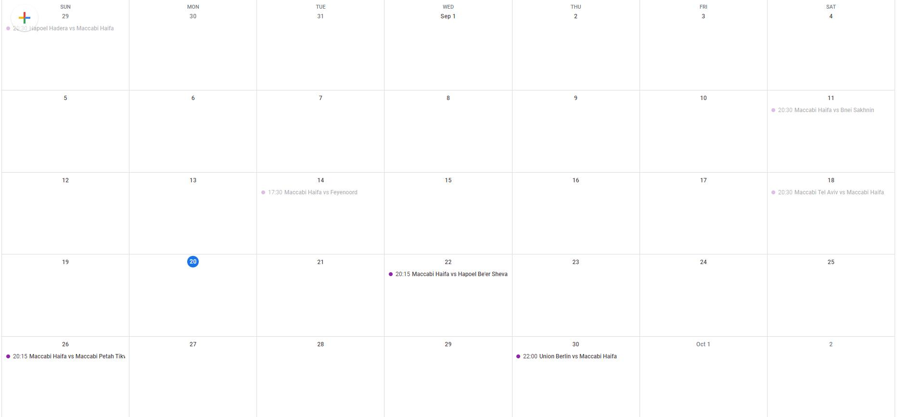

## Introduction
As football fan, I wanted to create a calendar which consistently updating with my team games.   
I created a small application, which fetch data from soccerway.com website and updating my dedicated google calendar with my team games schedual.  
To avoid duplication, I created a MySQL db as a container which stores relevant information, for example, if game synced already to calendar or not.  
example:

## prerequisites
MySQL DB
Optional: you can run as container or use existing MySQL DB)  
to run as container:  
mkdir /mysql && docker run --name some-mysql -v /mysql:/var/lib/mysql -e MYSQL_ROOT_PASSWORD=Db123456 -p 3306:3306 -d mysql:8.0.26  
  
edit env.sh to edit parameters:
MySQL and calendar id  
calendar id:  
it is recomennded to create dedicated calender, to pull calendar id, enter google calendar --> calendar --> options (3 dots next to calendar name) --> Settings and sharing --> Public URL to this calendar  

When you done editing env.sh file, save it.

Google api key (can achive by refernce at the end of the page) and store it with the name credentials.json at app folder. 
Shortly, enter:  
https://console.developers.google.com/project/_/apiui/apis/library  
create a project  
Menu --> APIs & Services --> Credentials  
Create credentials --> OAuth client id --> Application type: Web application  
Set a name
Under

under Authorized redirect URIs add:
http://localhost:8080/

And save
Download Json credentials (downlowd link next to your new OAuth 2.0 Client IDs application)
Copy URL from command line and paste it in browser, choose your google account and close browser after getting authentication flow has complated message  
file generated: token.pickle

To run application from host:  
Load env by running the command:
source env.sh
Run application:  
./main.py  
to build container and run it from container:  
docker build . -t gamecalendar:latest  
  
Load env by running the command:  
source env.sh  
#Edit parameters first  
docker run \
-e DATABASE_HOST=${DATABASE_HOST} \
-e DATABASE_PASSWORD=${DATABASE_PASSWORD} \
-e DATABASE_USER=${DATABASE_USER} \
-e DATABASE_NAME=${DATABASE_NAME} \
-e calendar_id=${calendar_id} \
-e timeZone=${timeZone}  \
-v "$(pwd)"/token.pickle:/app/token.pickle:ro \
--rm gamecalendar:latest

References:
https://developers.google.com/calendar/api/quickstart/python    
https://karenapp.io/articles/how-to-automate-google-calendar-with-python-using-the-calendar-api/    
https://google-calendar-simple-api.readthedocs.io/en/latest/events.html#list-events  
https://github.com/kuzmoyev/Google-Calendar-Simple-API  

